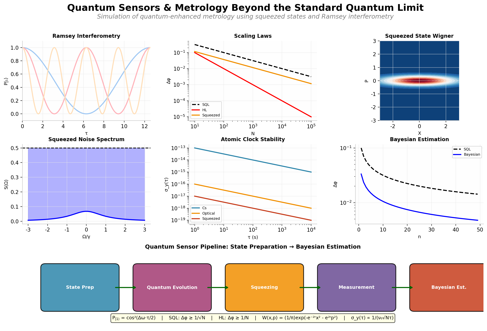

# Quantum Sensors & Metrology Beyond the Standard Quantum Limit



**Simulation of quantum-enhanced metrology using squeezed states and Ramsey interferometry. 
Models phase estimation precision scaling, atomic clock stability, and quantum noise spectra 
for sub-SQL sensing applications.**

---

## 🎯 Key Physics Demonstrated

| Concept | Description | Equation |
|---------|-------------|----------|
| **Ramsey Interferometry** | Population oscillations for phase sensing | $P_{|1\rangle} = \cos^2(\Delta\omega \cdot \tau/2)$ |
| **SQL vs HL Scaling** | Standard vs Heisenberg precision limits | SQL: $\sim 1/\sqrt{N}$ → HL: $\sim 1/N$ |
| **Squeezed States** | Sub-SQL uncertainty in one quadrature | $W(x,p) = \frac{1}{\pi}\exp(-e^{-2r}x^2 - e^{2r}p^2)$ |
| **Noise Spectrum** | Squeezed light below shot noise | $S(\Omega) &lt; 0.5$ (SQL) |
| **Atomic Clocks** | Allan deviation stability analysis | $\sigma_y(\tau) \propto 1/(\nu_0\sqrt{N\tau})$ |
| **Bayesian Estimation** | Adaptive phase estimation protocol | $P(\phi|D) \propto P(D|\phi) \cdot P(\phi)$ |

---

## 📊 Generated Figures

### Figure 1: Ramsey Interferometry

- **(a)** Ramsey fringes for different detunings
- **(b)** Phase sensitivity (fringe slope)
- **(c)** Pulse sequence diagram
- **(d)** Shot noise simulation

### Figure 2: Quantum Metrology Scaling Laws

- **(a)** SQL vs HL with squeezed state interpolation
- **(b)** Wineland squeezing parameter
- **(c)** State-dependent phase estimation
- **(d)** Quantum Fisher Information

### Figure 3: Squeezed State Wigner Function

- **(a)** 2D Wigner function contour plot
- **(b)** Cross-sections for different r
- **(c)** Uncertainty ellipses in phase space
- **(d)** Quadrature variances vs squeezing

### Figure 4: Squeezed Light Noise Spectrum

- **(a)** Noise spectrum below SQL
- **(b)** Noise reduction vs squeezing parameter
- **(c)** Multiple squeezing levels
- **(d)** Balanced homodyne detection schematic

### Figure 5: Atomic Clock Stability

- **(a)** Allan deviation: Cs, ion, optical lattice
- **(b)** Scaling with atom number
- **(c)** Dick effect & laser noise coupling
- **(d)** Stability budget comparison

### Figure 6: Quantum Sensor Architecture

Full pipeline from state preparation through Bayesian estimation

### Figure 7: Bayesian Phase Estimation

- **(a)** Posterior convergence
- **(b)** Error scaling vs measurements
- **(c)** Adaptive phase selection
- **(d)** Cumulative Fisher information

---

## 🚀 Quick Start

### Installation
```bash
git clone https://github.com/YOUR_USERNAME/quantum-sensors-metrology.git
cd quantum-sensors-metrology
python -m venv venv
source venv/bin/activate  # Windows: venv\Scripts\activate
pip install -r requirements.txt
